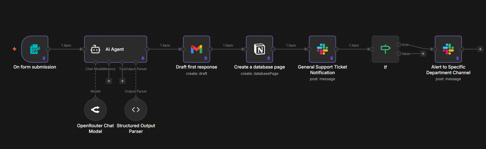
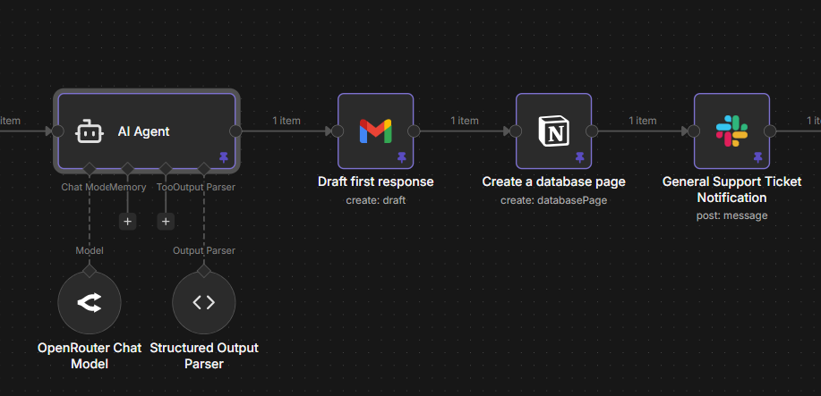
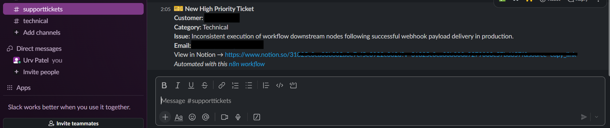

# 🎫 AI Customer Support Triage & Automated Ticketing System

> Built with n8n · OpenRouter (Gemini) · Gmail API · 
Notion API · Slack API

---

## The Problem

Support teams waste hours manually reading tickets, deciding who 
handles what, and writing first responses. High priority issues get 
buried in inboxes. Customers wait too long. Departments never get 
notified in time.

---

## What This Does

A fully automated support triage engine that activates the moment 
a customer submits a support form — classifying, routing, logging, 
and responding without a single human touchpoint.

**Key capabilities:**
- Reads every ticket and assigns a category: Billing, Technical, 
  Feature Request, or General
- Scores each ticket by urgency: High, Medium, or Low priority
- Drafts a personalized first-response email with priority-appropriate 
  SLA messaging
- Logs every ticket instantly to Notion with full customer details
- Routes structured Slack notifications to the general support channel
- Escalates high-priority tickets to department-specific Slack channels
- Eliminated manual triage entirely across the support intake workflow

---

## Workflow Overview



---

## Classification & Routing Logic



---

## Sample Output



> End-to-end result — from form submission to categorized ticket, 
drafted response, Notion log, and Slack alert, fully automated 
with zero manual triage.

---

## Tech Stack

| Tool | Role |
|---|---|
| n8n | Workflow orchestration |
| OpenRouter (Gemini) | Ticket classification, urgency scoring and response drafting |
| Gmail API | Personalized first-response delivery |
| Notion API | Structured ticket logging and CRM |
| Slack API | Team notifications and department escalations |

---

## How To Use This Workflow

1. Download `support-triage-ticketing-system.json`
2. Open your n8n instance
3. Click **Import** and select the JSON file
4. Configure your credentials for Gmail, Notion,
   Slack, and OpenRouter
5. Connect your support form webhook to the trigger node
6. Set your Slack channel IDs for general and department channels
7. Activate the workflow

---

## Outcome

From form submission to categorized ticket, drafted response, 
Notion log, and Slack alert — fully automated, zero manual triage, 
urgent issues escalated in seconds.
```
